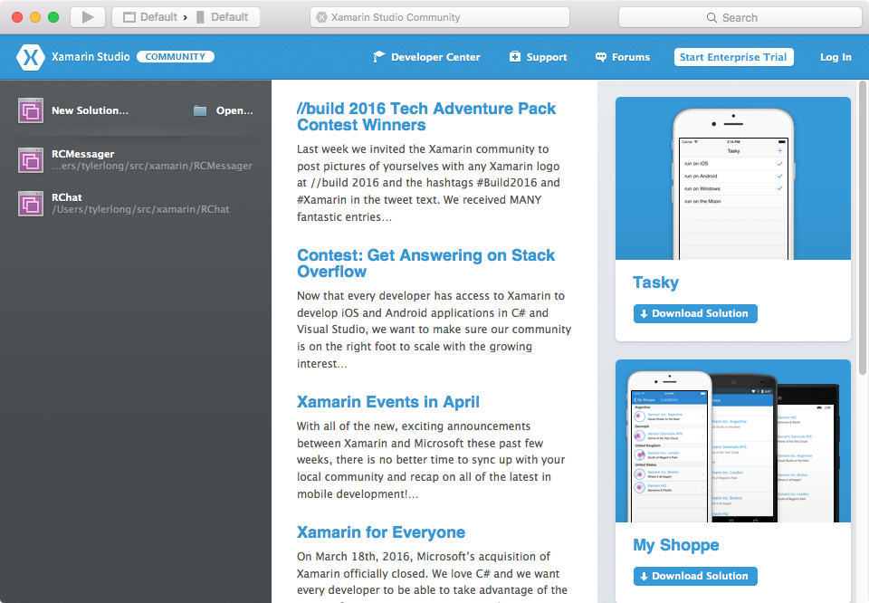

# Install RingCentral C# SDL

This tutorial demonstrates how to create a new project and install the latest RingCentral C# SDK.

## Xamarin Studio for Mac

Launch Xamarin Studio

Press keyboard shortcut: `Shift + CMD + N`:

