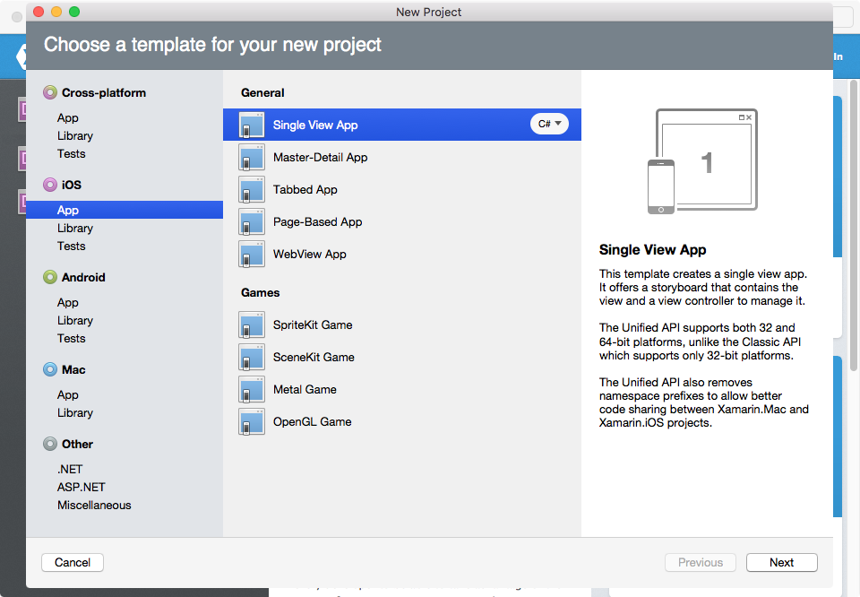

# Install RingCentral C# SDK

This tutorial demonstrates how to create a new project and install the latest RingCentral C# SDK.

## Xamarin Studio for Mac

Launch Xamarin Studio

Press keyboard shortcut: `Shift + CMD + N` to create a new solution

Choose iOS -> App -> Single View App, click Next

Here we take an iOS app for example.
The method demonstrated here should also work for Android apps and Mac apps.
